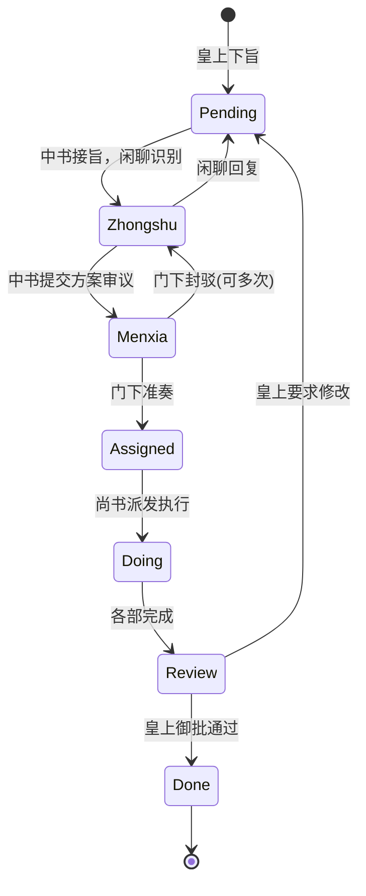

# 三省六部任务分发流转体系 · 业务与技术架构

> 本文档详细阐述「三省六部」项目如何从**业务制度设计**到**代码实现细节**，完整处理复杂多Agent协作的任务分发与流转。这是一个**制度化的AI多Agent框架**，而非传统的自由讨论式协作系统。

**文档概览图**

```
━━━━━━━━━━━━━━━━━━━━━━━━━━━━━━━━━━━━━━━━━━━━━━━━━━━━━━━━━━━━━
业务层：帝国制度 (Imperial Governance Model)
  ├─ 分权制衡：皇上 → 中书 → 门下 → 尚书 → 六部
  ├─ 制度约束：不可越级、状态严格递进、门下必审议
  └─ 质量保障：可封驳反工、实时可观测、紧急可干预
━━━━━━━━━━━━━━━━━━━━━━━━━━━━━━━━━━━━━━━━━━━━━━━━━━━━━━━━━━━━━
技术层：OpenClaw多Agent编排 (Multi-Agent Orchestration)
  ├─ 状态机：8个状态（Pending → Zhongshu → Menxia → Assigned → Doing/Next → Review → Done/Cancelled）
  ├─ 数据融合：flow_log + progress_log + session JSONL → unified activity stream
  ├─ 权限矩阵：严格的subagent调用权限控制
  └─ 调度层：自动派发、超时重试、停滞升级、自动回滚
━━━━━━━━━━━━━━━━━━━━━━━━━━━━━━━━━━━━━━━━━━━━━━━━━━━━━━━━━━━━━
观测层：React 看板 + 实时API (Dashboard + Real-time Analytics)
  ├─ 任务看板：10个视图面板（全部/按状态/按部门/按优先级等）
  ├─ 活动流：混合活动记录（思考过程、工具调用、状态转移）
  └─ 在线状态：Agent 实时节点检测 + 心跳喚醒机制
━━━━━━━━━━━━━━━━━━━━━━━━━━━━━━━━━━━━━━━━━━━━━━━━━━━━━━━━━━━━━
```

---

## 📚 第一部分：业务架构

### 1.1 帝国制度：分权制衡的设计哲学

#### 核心理念

传统的多Agent框架（如CrewAI、AutoGen）采用**"自由协作"模式**：
- Agent自主选择协作对象
- 框架仅提供通信通道
- 质量控制完全依赖Agent智能
- **问题**：容易出现Agent相互制造假数据、重复工作、方案质量无保障

**三省六部**采用**"制度化协作"模式**，模仿古代帝国官僚体系：

```
              皇上
              (User)
               │
               ↓
           中书省 (Zhongshu)
      [分拣规划官、消息接入、方案起草总负责]
      ├─ 识别：这是日常查询还是圣旨？
      ├─ 执行：直接回复日常查询 || 圣旨分析需求
      ├─ 拆解为子任务（todos）
      ├─ 调用门下省审议 OR 尚书省咨询
      └─ 权限：只能调用 门下省
               │
               ↓
           门下省 (Menxia)
        [审议官、质量把握人]
      ├─ 审查中书方案（可行性、完整性、风险）
      ├─ 准奏 OR 封驳（含修改建议）
      ├─ 若封驳 → 返回中书修改 → 重新审议（最多3轮）
      └─ 权限：只能回调中书省（准奏/封驳结果），不可直接调用尚书省
               │
         (✅ 准奏)
               │
               ↓
           尚书省 (Shangshu)
        [派发官、执行总指挥]
      ├─ 接到准奏方案
      ├─ 分析派发给哪个部门
      ├─ 调用六部（礼/户/兵/刑/工/吏）执行
      ├─ 监控各部进度 → 汇总结果
      └─ 权限：只能调用 六部（不能越权调中书）
               │
               ├─ 礼部 (Libu)      - 文档编制官
               ├─ 户部 (Hubu)      - 数据分析官
               ├─ 兵部 (Bingbu)    - 代码实现官
               ├─ 刑部 (Xingbu)    - 测试审查官
               ├─ 工部 (Gongbu)    - 基础设施官
               └─ 吏部 (Libu_hr)   - 人力资源官
               │
         (各部并行执行)
               ↓
           尚书省·汇总
      ├─ 收集六部结果
      ├─ 状态转为 Review
      ├─ 回调中书省转报皇上
               │
               ↓
           中书省·回奏
      ├─ 汇总现象、结论、建议
      ├─ 状态转为 Done
      └─ 回复飞书消息给皇上
```

#### 制度的4大保障

| 保障机制 | 实现细节 | 防护效果 |
|---------|---------|---------|
| **制度性审核** | 门下省必审议所有中书方案，不可跳过 | 防止Agent胡乱执行，确保方案具有可行性 |
| **分权制衡** | 权限矩阵：谁能调谁严格定义 | 防止权力滥用（如尚书越权调中书改方案） |
| **完全可观测** | 任务看板10个面板 + 活动流 | 实时看到任务卡在哪、谁在工作、工作状态如何 |
| **实时可干预** | 看板内一键 stop/cancel/resume/advance | 紧急情况（如发现Agent走错方向）能立即纠正 |

---

### 1.2 任务完整流转流程

#### 流程示意图



---

### 1.3 任务规格书与业务契约

#### Task Schema 字段说明

```json
{
  "id": "JJC-20260228-E2E",          // 任务全局唯一ID (JJC-日期-序号)
  "title": "为三省六部编写完整自动化测试方案",
  "official": "中书省",              // 负责官职
  "org": "中书省",                   // 当前负责部门
  "state": "Assigned",               // 当前状态（见 _STATE_FLOW）
  
  // ──── 质量与约束 ────
  "priority": "normal",              // 优先级：critical/high/normal/low
  "block": "无",                     // 当前阻滞原因（如"等待工部反馈"）
  "reviewRound": 2,                  // 门下审议第几轮
  "_prev_state": "Menxia",           // 若被 stop，记录之前状态用于 resume
  
  // ──── 业务产出 ────
  "output": "",                      // 最终任务成果（URL/文件路径/总结）
  "ac": "",                          // Acceptance Criteria（验收标准）
  
  // ──── 流转记录 ────
  "flow_log": [
    {
      "at": "2026-02-28T10:00:00Z",
      "from": "皇上",
      "to": "中书省",
      "remark": "下旨：为三省六部编写完整自动化测试方案"
    },
    {
      "at": "2026-02-28T15:00:00Z",
      "from": "中书省",
      "to": "门下省",
      "remark": "规划方案提交审议"
    },
    {
      "at": "2026-03-01T09:00:00Z",
      "from": "门下省",
      "to": "中书省",
      "remark": "🚫 封驳：需补充性能测试"
    },
    {
      "at": "2026-03-01T15:00:00Z",
      "from": "中书省",
      "to": "门下省",
      "remark": "修订方案（第2轮审议）"
    },
    {
      "at": "2026-03-01T20:00:00Z",
      "from": "门下省",
      "to": "尚书省",
      "remark": "✅ 准奏通过（第2轮，5条建议已采纳）"
    }
  ],
  
  // ──── Agent 实时汇报 ────
  "progress_log": [
    {
      "at": "2026-02-28T10:35:00Z",
      "agent": "zhongshu",              // 汇报agent
      "agentLabel": "中书省",
      "text": "已接旨。分析测试需求，拟定三层测试方案...",
      "state": "Zhongshu",              // 汇报时的状态快照
      "org": "中书省",
      "tokens": 4500,                   // 资源消耗
      "cost": 0.0045,
      "elapsed": 120,
      "todos": [                        // 待办任务快照
        {"id": "1", "title": "需求分析", "status": "completed"},
        {"id": "2", "title": "方案设计", "status": "in-progress"},
        {"id": "3", "title": "await审议", "status": "not-started"}
      ]
    }
  ],
  
  // ──── 调度元数据 ────
  "_scheduler": {
    "enabled": true,
    "stallThresholdSec": 180,         // 停滞超过180秒自动升级
    "maxRetry": 1,                    // 自动重试最多1次
    "retryCount": 0,
    "escalationLevel": 0,             // 0=无升级 1=门下协调 2=尚书协调
    "lastProgressAt": "2026-03-01T20:00:00Z",
    "stallSince": null,               // 何时开始停滞
    "lastDispatchStatus": "success",  // queued|success|failed|timeout|error
    "snapshot": {
      "state": "Assigned",
      "org": "尚书省",
      "note": "review-before-approve"
    }
  },
  
  // ──── 生命周期 ────
  "archived": false,                 // 是否归档
  "now": "门下省准奏，移交尚书省派发",  // 当前实时状态描述
  "updatedAt": "2026-03-01T20:00:00Z"
}
```

#### 业务契约

| 契约             | 含义                                       | 违反后果                             |
| -------------- | ---------------------------------------- | -------------------------------- |
| **不可越级**       | 皇上只能调中书，中书只能调门下，门下只能调尚书，尚书调六部，六部不能对外调用   | 超权调用被拒绝，系统自动拦截                   |
| **状态单向递进**     | Pending → Zhongshu → ... → Done，不能跳过或倒退 | 只能通过 review_action(reject) 返回上一步 |
| **门下必审**       | 所有中书提出的方案都要门下省审议，无法跳过                    | 中书不能直接转尚书，门下必入                   |
| **一旦Done无改**   | 任务进入Done/Cancelled后不能再修改状态               | 若需修改需要创建新任务或取消后重新建               |
| **task_id唯一性** | JJC-日期-序号 全局唯一，同一天同一任务不重复建               | 看板防重，自动去重                        |
| **资源消耗透明**     | 每次进展汇报都要上报 tokens/cost/elapsed           | 便于成本核算和性能优化                      |

---

## 🔧 第二部分：技术架构

### 2.1 状态机与自动派发

#### 状态转移完整定义

```python
_STATE_FLOW = {
    'Pending':  ('Zhongshu',   '皇上',    '中书省',    '待处理旨意转交中书省分拣'),
    'Zhongshu': ('Menxia',  '中书省',  '门下省',  '中书省方案提交门下省审议'),
    'Menxia':   ('Assigned','门下省',  '尚书省',  '门下省准奏，转尚书省派发'),
    'Assigned': ('Doing',   '尚书省',  '六部',    '尚书省开始派发执行'),
    'Next':     ('Doing',   '尚书省',  '六部',    '待执行任务开始执行'),
    'Doing':    ('Review',  '六部',    '尚书省',  '各部完成，进入汇总'),
    'Review':   ('Done',    '尚书省',  '中书省',    '全流程完成，回奏中书省转报皇上'),
}
```

每个状态自动关联 Agent ID（见 `_STATE_AGENT_MAP`）：

```python
_STATE_AGENT_MAP = {
    'Zhongshu': 'zhongshu',
    'Menxia':   'menxia',
    'Assigned': 'shangshu',
    'Doing':    None,      # 从 org 推断（六部之一）
    'Next':     None,      # 从 org 推断
    'Review':   'shangshu',
    'Pending':  'zhongshu',
}
```

#### 自动派发流程

当任务状态转移时（通过 `handle_advance_state()` 或审批），后台自动执行派发：

```
1. 状态转移触发派发
   ├─ 查表 _STATE_AGENT_MAP 得到目标 agent_id
   ├─ 若是 Doing/Next，从 task.org 查表 _ORG_AGENT_MAP 推断具体部门agent
   └─ 若无法推断则跳过派发（如 Done/Cancelled）

2. 构造派发消息（针对性促使Agent立即工作）
   ├─ zhongshu: "📜 旨意已到中书省，请起草方案..."
   ├─ menxia: "📋 中书省方案提交审议..."
   ├─ shangshu: "📮 门下省已准奏，请派发执行..."
   └─ 六部: "📌 请处理任务..."

3. 后台异步派发（非阻塞）
   ├─ spawn daemon thread
   ├─ 标记 _scheduler.lastDispatchStatus = 'queued'
   ├─ 检查 Gateway 进程是否开启
   ├─ 运行 openclaw agent --agent {id} -m "{msg}" --deliver --timeout 300
   ├─ 重试最多2次（失败间隔5秒退避）
   ├─ 更新 _scheduler 状态和错误信息
   └─ flow_log 记录派发结果

4. 派发状态转移
   ├─ success: 立即更新 _scheduler.lastDispatchStatus = 'success'
   ├─ failed: 记录失败原因，Agent 超时不会 block 看板
   ├─ timeout: 标记 timeout，允许用户手动重试 / 升级
   ├─ gateway-offline: Gateway 未启动，跳过此次派发（后续可重试）
   └─ error: 异常情况，记录堆栈供调试

5. 到达目标Agent的处理
   ├─ Agent 从飞书消息收到通知
   ├─ 通过 kanban_update.py 与看板交互（更新状态/记录进展）
   └─ 完成工作后再次触发派发到下一个Agent
```

---

### 2.2 权限矩阵与Subagent调用

#### 权限定义（openclaw.json 中配置）

```json
{
  "agents": [
    {
      "id": "zhongshu",
      "label": "中书省",
      "allowAgents": ["menxia", "shangshu"]
    },
    {
      "id": "menxia",
      "label": "门下省",
      "allowAgents": ["zhongshu"]
    },
    {
      "id": "shangshu",
      "label": "尚书省",
      "allowAgents": ["zhongshu", "menxia", "libu", "hubu", "bingbu", "xingbu", "gongbu", "libu_hr"]
    },
    {
      "id": "libu",
      "label": "礼部",
      "allowAgents": ["shangshu"]
    }
  ]
}
```

#### 权限设计原则

| 原则 | 说明 |
|-----|------|
| **中书省为唯一调度中枢** | 中书省可提交门下省审议，也可直接咨询尚书省（特殊场景） |
| **门下省仅返回中书省** | 门下省审议后只能返回中书省（封驳或准奏），不可直接调用尚书省 |
| **尚书省统筹执行** | 尚书省可协调六部执行，封驳场景可返回门下省，完成后回传中书省 |
| **六部仅回传尚书省** | 六部+吏部只能向尚书省汇报，不可跨部门直接通信 |

#### 权限检查机制（代码层面）

```python
def can_dispatch_to(from_agent, to_agent):
    """检查 from_agent 是否有权调用 to_agent。"""
    cfg = read_json(DATA / 'agent_config.json', {})
    agents = cfg.get('agents', [])
    
    from_record = next((a for a in agents if a.get('id') == from_agent), None)
    if not from_record:
        return False, f'{from_agent} 不存在'
    
    allowed = from_record.get('allowAgents', [])
    if to_agent not in allowed:
        return False, f'{from_agent} 无权调用 {to_agent}（允许列表：{allowed}）'
    
    return True, 'OK'
```

---

### 2.3 调度系统：超时重试、停滞升级、自动回滚

#### 调度元数据结构

```python
_scheduler = {
    # 配置参数
    'enabled': True,
    'stallThresholdSec': 180,         # 停滞多久后自动升级（默认180秒）
    'maxRetry': 1,                    # 自动重试次数（0=不重试，1=重试1次）
    'autoRollback': True,             # 是否自动回滚到快照
    
    # 运行时状态
    'retryCount': 0,                  # 当前已重试几次
    'escalationLevel': 0,             # 0=无升级 1=门下协调 2=尚书协调
    'stallSince': None,               # 何时开始停滞的时间戳
    'lastProgressAt': '2026-03-01T...',  # 最后一次获得进展的时间
    
    # 派发追踪
    'lastDispatchStatus': 'success',  # queued|success|failed|timeout|gateway-offline|error
    'lastDispatchAgent': 'zhongshu',
    'lastDispatchTrigger': 'state-transition',
    
    # 快照（用于自动回滚）
    'snapshot': {
        'state': 'Assigned',
        'org': '尚书省',
        'now': '等待派发...',
        'savedAt': '2026-03-01T...',
        'note': 'scheduled-check'
    }
}
```

#### 调度算法

每 60 秒运行一次 `handle_scheduler_scan(threshold_sec=180)`：

```
FOR EACH 任务:
  IF state in (Done, Cancelled, Blocked):
    SKIP  # 终态不处理
  
  elapsed_since_progress = NOW - lastProgressAt
  
  IF elapsed_since_progress < stallThreshold:
    SKIP  # 最近有进展，无需处理
  
  # ── 停滞处理逻辑 ──
  IF retryCount < maxRetry:
    ✅ 执行【重试】
    - increment retryCount
    - dispatch_for_state(task, new_state, trigger='zhongshu-scan-retry')
    - flow_log: "停滞180秒，触发自动重试第N次"
    - NEXT task
  
  IF escalationLevel < 2:
    ✅ 执行【升级】
    - nextLevel = escalationLevel + 1
    - target_agent = menxia (if L=1) else shangshu (if L=2)
    - wake_agent(target_agent, "💬 任务停滞，请介入协调推进")
    - flow_log: "升级至{target_agent}协调"
    - NEXT task
  
  IF escalationLevel >= 2 AND autoRollback:
    ✅ 执行【自动回滚】
    - restore task to snapshot.state
    - retryCount = 0
    - escalationLevel = 0
    - dispatch_for_state(task, snapshot.state, trigger='zhongshu-auto-rollback')
    - flow_log: "连续停滞，自动回滚到{snapshot.state}"
```

---

## 🎯 第三部分：核心API与CLI工具

### 3.1 任务操作API端点

#### 任务创建：`POST /api/create-task`

```
请求：
{
  "title": "为三省六部编写完整自动化测试方案",
  "org": "中书省",           // 可选
  "official": "中书令",      // 可选
  "priority": "normal",
  "template_id": "test_plan", // 可选
  "params": {},
  "target_dept": "兵部+刑部"  // 可选，派发建议
}

响应：
{
  "ok": true,
  "taskId": "JJC-20260228-001",
  "message": "旨意 JJC-20260228-001 已下达，正在派发给中书省"
}
```

#### 审批操作：`POST /api/review-action/{task_id}`

```
请求（准奏）：
{
  "action": "approve",
  "comment": "方案可行，已采纳改进建议"
}

OR 请求（封驳）：
{
  "action": "reject",
  "comment": "需补充性能测试，第N轮审议"
}

响应：
{
  "ok": true,
  "message": "JJC-20260228-001 已准奏 (已自动派发 Agent)",
  "state": "Assigned",
  "reviewRound": 1
}
```

---

### 3.2 CLI工具：kanban_update.py

Agent 通过此工具与看板交互：

```bash
# 更新状态
python3 scripts/kanban_update.py state \
  JJC-20260228-001 \
  Menxia \
  "方案提交门下省审议"

# 实时进展汇报
python3 scripts/kanban_update.py progress \
  JJC-20260228-001 \
  "已完成需求分析和方案初稿" \
  "1.需求分析✅|2.方案设计✅|3.工部咨询🔄|4.待门下审议"

# 任务完成
python3 scripts/kanban_update.py done \
  JJC-20260228-001 \
  "https://github.com/org/repo/tree/feature/auto-test" \
  "自动化测试方案已完成"
```

---

## 💡 第四部分：对标与对比

### CrewAI / AutoGen 的传统方式 vs 三省六部的制度化方式

| 维度 | CrewAI | AutoGen | **三省六部** |
|------|--------|---------|----------|
| **协作模式** | 自由讨论 | 面板+回调 | **制度化协作（权限矩阵+状态机）** |
| **质量保障** | 依赖Agent智能 | Human审核 | **自动审核（门下省必审）+可干预** |
| **权限控制** | ❌ 无 | ⚠️ Hard-coded | **✅ 配置化权限矩阵** |
| **可观测性** | 低 | 中 | **极高（完整活动流）** |
| **可干预性** | ❌ 无 | ✅ 有 | **✅ 有（一键stop/cancel/advance）** |
| **失败恢复** | ❌ | ⚠️ | **✅（自动重试3阶段）** |

---

## 📋 总结

**三省六部是一个制度化的AI多Agent系统**，通过：

1. **业务层**：模仿古代帝国官僚体系，建立分权制衡的组织结构
2. **技术层**：状态机 + 权限矩阵 + 自动派发 + 调度重试，确保流程可控
3. **观测层**：React 看板 + 完整活动流，实时掌握全局
4. **介入层**：一键stop/cancel/advance，遇到异常能立即纠正

**核心价值**：用制度确保质量，用透明确保信心，用自动化确保效率。
